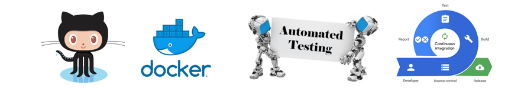

&nbsp;&nbsp;&nbsp;&nbsp;&nbsp;&nbsp;Effective and efficient automated software testing is crucial to helping organizations deliver better software, faster. Manual testing in comparison, where a human being is responsible for testing the functionality of the software in the way a user would, requires more time in exploratory tests. Although manual testing “allows a human mind to draw insights from a test that might otherwise be missed by an automated testing program”, automated testing is well-suited for large projects; projects that require testing the same areas over and over; and projects that have already been through an initial manual testing process. 

&nbsp;&nbsp;&nbsp;&nbsp;&nbsp;&nbsp;Throughout the testing and development phase developers integrate code into a shared repository frequently, preferably several times a day. Each integration can then be verified by an automated build and automated tests. While automated testing is not strictly part of continuous integration it is typically implied.

&nbsp;&nbsp;&nbsp;&nbsp;&nbsp;&nbsp;Continuous integration, a software development strategy that increases the speed of development while ensuring the quality of the code allows developers to continually commit small increments of code (at least daily, or even several times a day), which is then automatically built and tested before it is merged with the shared repository.

&nbsp;&nbsp;&nbsp;&nbsp;&nbsp;&nbsp;Automated testing coupled with continuous integration is a process that practically guarantees team productivity and efficiency, quicker time to market, higher quality & more stable products and an increase in customer satisfaction.

&nbsp;&nbsp;&nbsp;&nbsp;&nbsp;&nbsp;Recent times have been aptly named “The Age of the Apps”, “Mobile marketing provides a huge opportunity for marketers to engage with customers and prospects anytime, anywhere. This ability for marketers to be “constantly connected” has been made possible largely due to the emergence of mobile applications.” –Industry Week. This drive to meet the needs and desires of consumers have placed pressure on developers to get new versions to market more quickly. Therefore, there is always a demand for processes that successfully makes this happen for companies to remain competitive in the market.

&nbsp;&nbsp;&nbsp;&nbsp;&nbsp;&nbsp;Git and Docker, a version control and an operating-system-level virtualization, respectively, are systems that work in conjunction with automated testing and continuous integration.  A repository tool like GitHub, is one of the most important tools for the creation process since it’s used to hold the code. Developers can commit small increments of code (at least daily, or even several times a day), which is then automatically built and tested before it is merged with the shared repository. In response, every commit triggers an automated build and test and if a build and test fail, it can be repaired quickly. Once verified, the developer can then merge the new branch of code into production. By reducing delay and overall development time, developers are setting the stage for a more efficient and productive development process, thus increasing the competitiveness and marketability of a company.

&nbsp;&nbsp;&nbsp;&nbsp;&nbsp;&nbsp;Docker is a software platform for building applications based on containers.  Containers offer a way to speed application delivery and increase application portability, by allowing developers to isolate code to a single self-contained function, which makes it easier to modify and update the code. Containerization of software, a facet of Docker, allows improvements in the continuous delivery process.  Continuous delivery, an extension of continuous integration, happens when your software is deployable at any time, when you can easily push any version of your software on demand to any environment, and when you or anybody else in the development team can get immediate, automated feedback on the impact of changes to the software from a production readiness standpoint. The biggest improvements are in speed and in the level of abstraction which are essential for further innovations in this field. Thus, reducing the time of the overall development process.  

&nbsp;&nbsp;&nbsp;&nbsp;&nbsp;&nbsp;Git, Docker, automated testing and continuous integration are tools and methods that can improve the productivity and competitiveness of a company by offering processes that increase the speed of development while ensuring the quality of the code, thus making a company more productive and competitive.

